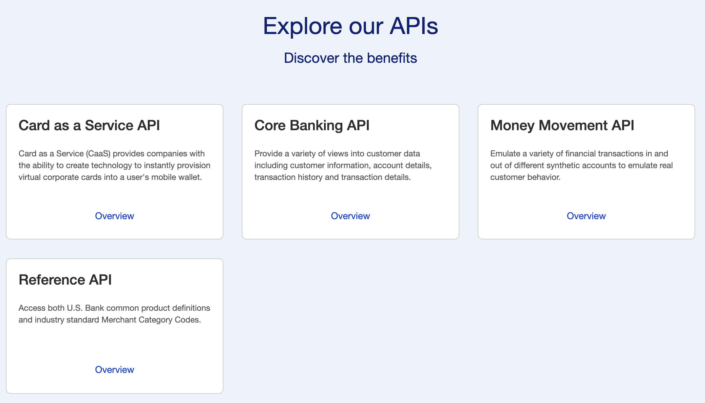
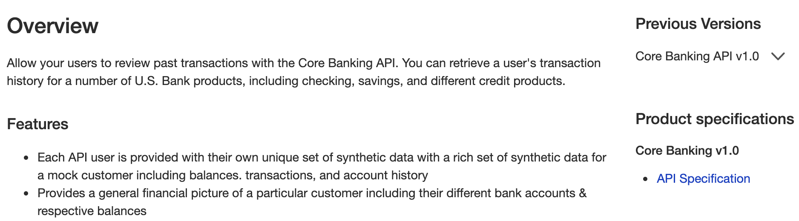
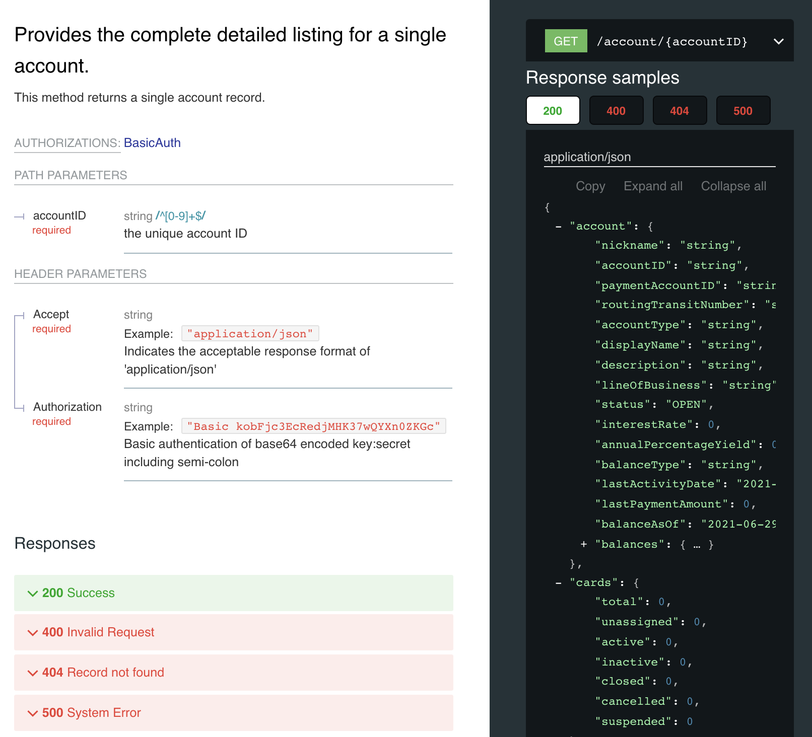
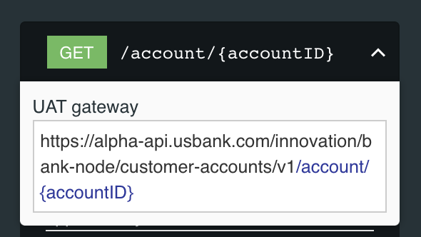

## Exploring the APIs

From the main portal page, scroll down to the area with the API tiles.

You will see a brief description of each API. For more details, click the *Overview* link within the API tile.

This will provide an overview of each API including its main features and possible use cases.

The detailed API specification are available in the right hand column listed under *Product Specifications*

These specifications are written in well-formatted YAML documents. Below is a portion of the specifications for the *Core Banking API*.

In the picture above, you can see an element of an API specification: *GET /account/{accountid}* (specifically, the structure of a successful response message (status = 200).

The API specification will show the request and response messages for **all** of the available methods for an API.

You can also view the specific URL to the API by clicking the arrow in the API specification.

