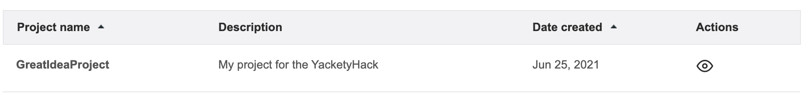
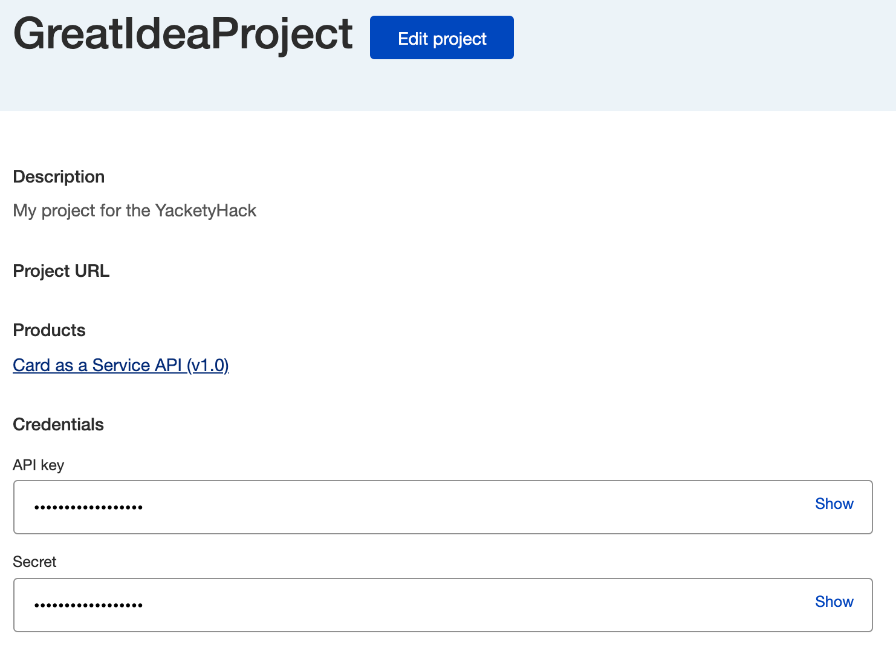
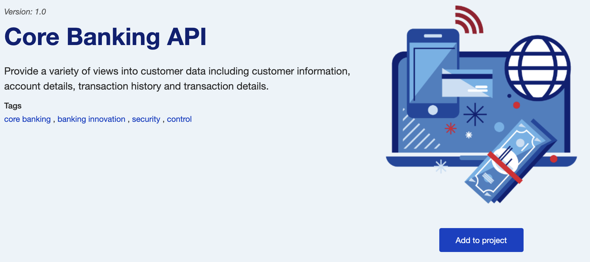
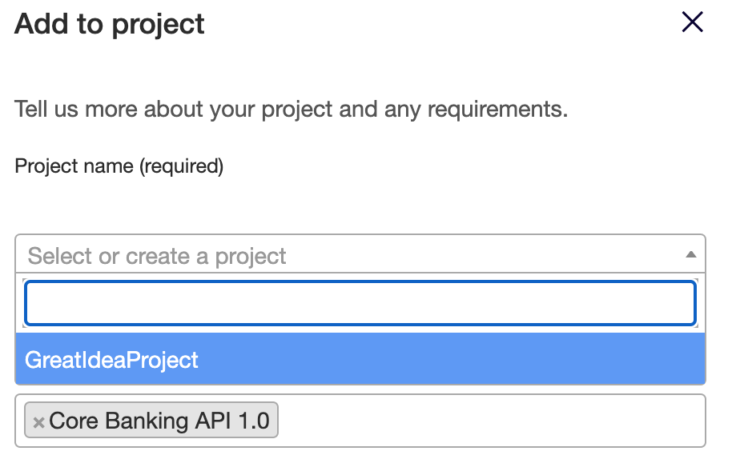

# Using the APIs

In order utilize the APIs that are exposed through the developer portal, you will need to obtain an API key. This is a unique key code generated for you and will be used to authentication when calling a secure API.

The process for obtaining a key involves the creation of a project on the portal (which will generate an API key). Then, you link your project to other APIs which basically provisions them to your account.

## Creating a project

**Step 1** In order to create a project, you need to go to the project menu which is located under your name on the right side of the title bar.

 **Step 2** Click on the *Projects* link to go to your *Projects* page. Here you will find all of your currently defined projects. In the beginning there will be no entries.

 

 **Step 3** Click on the *Create new project* button to bring up the dialog window to define a new project.

 

 **Step 4** In the dialog window, give your project a useful name. You must also select at least one API from the drop down box (listed as "Select products").

 You can also provide a project description if you want. At this time, you can ignore the *Project URL* field. It is a more advanced feature.

 Once you have filled out everything, you can click *Save* and see that your project has now been created.

 

### Viewing your API credentials
 The *eye* icon listed under actions allows you to view the details of your created project including its API credentials.

For this hackathon, you will need to use both the API key and the secret for authentication. You can see these values by clicking the *Show* link on the right.

## Adding more API products to your project

In general, you will want to add all of the APIs to your project so that you can use them within your application. In order to do this, you will need to go to each API product page and add it manually. You can easily get to each API product by selecting the *Product* menu on the home page.

**Step 1** Select the API product to go to its specific page.

 

**Step 2** Located on the right hand side is the *Add to project* button. When you click this button, you will be taken to the *Add to project* form.

**Step 3** Select your project name from the drop down box and click *Save* to associate this API product to it. You will now see that this API has been added to your project.

Alternatively, you can also create a new project from this form. Simply, enter in a new name in the provided box. You can also include an optional description.
