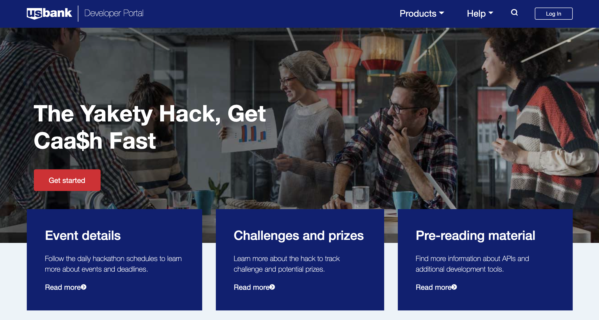
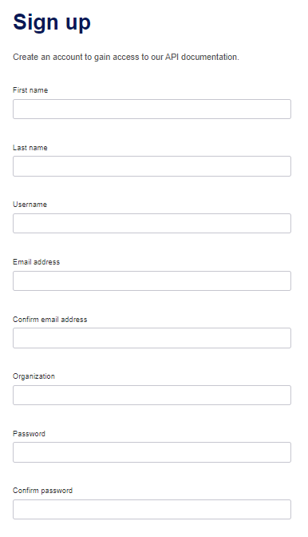
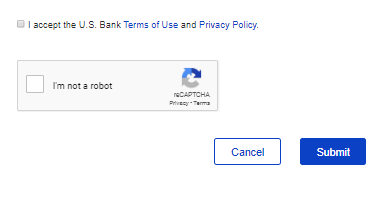
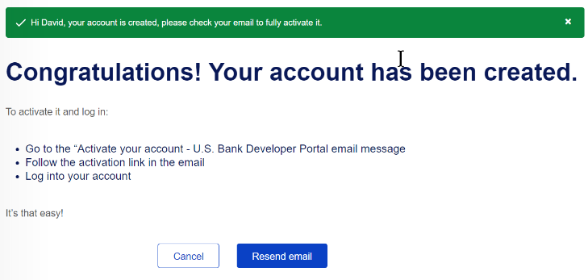
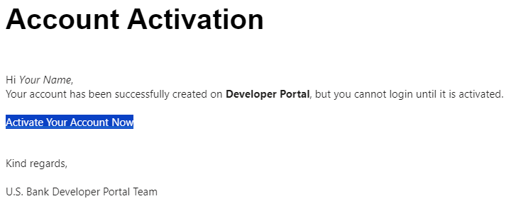
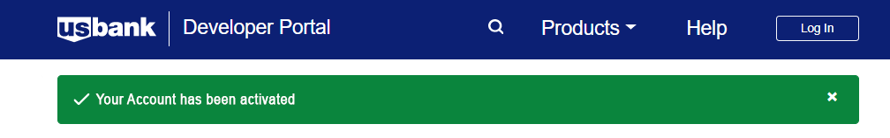

## Getting started

### Getting access to the hacakathon developer portal

The *Hack to Track: Saving $$$ Bit by Bit* developer portal is located at: [hacktotrack-innovation.usbank.com](https://hacktotrack-innovation.usbank.com). The site is restricted so you will need to obtain an account before viewing any of the API content.

### Requesting an account

Self-service registration is quite simple and efficient.

**Step 1** From the main page, click on the "Get started" button
This will open a new window with a complete registration form to create a new account.

*Alternatively, you can click on the "Login" button in the upper right corner and follow the link to create a new user*

**Step 2** Fill out the form
Fill out all of the required fields including a valid email address (in order to receive the registration confirmation message).

You will need to create your own unique *Username* which must be between 7 and 30 characters (complete details about each field can be found by hovering your cursor over the field itself).

**Step 3** Submit your registration

Review and accept the *Terms of Use* and *Privacy Policy* for using the portal.

Complete the Captcha to confirm that you are not a bot.

Finally, submit your registration and you should be taken to a screen like below.

**Step 4** Check your email
Find the confirmation message in the email account that you provided earlier.

**Step 5** Click on the *Activate Your Account Now* link to complete your registration.

This will open up the developer portal in a new browser window with a success message in the banner.

**Step 6** Finally, click on the "Login" button in the upper right to log into the developer portal using your newly created credentials.
