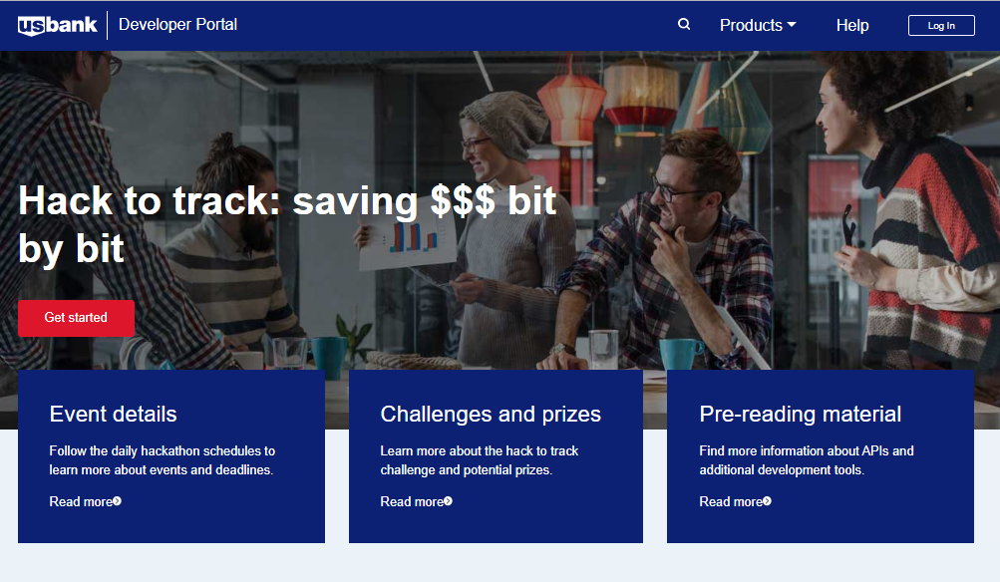
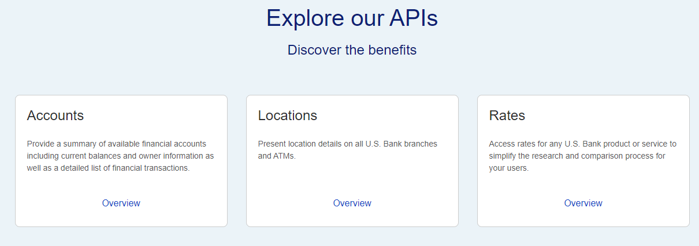
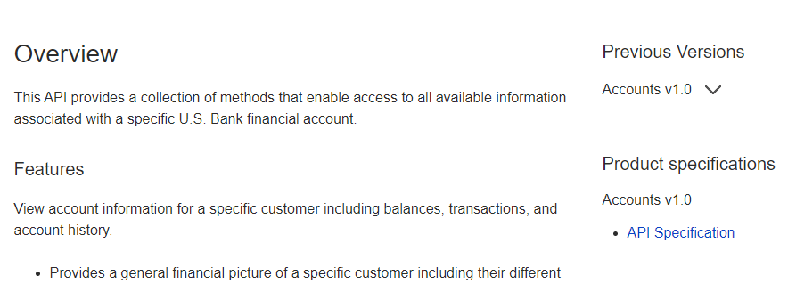
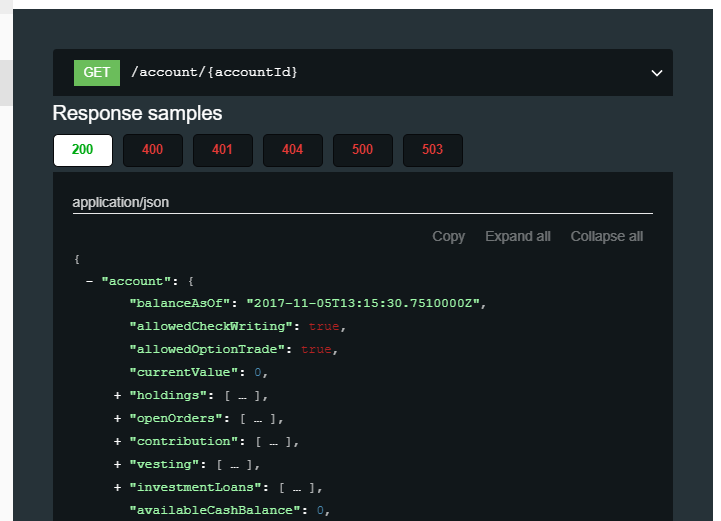

## Getting started

### Getting access to the hacakathon developer portal

The *Hack to Track: Saving $$$ Bit by Bit* developer portal is located at: [hacktotrack-innovation.usbank.com](https://hacktotrack-innovation.usbank.com). The site is restricted so you will need to obtain an account before viewing any of the API content.

### Requesting an account

Self-service registration is quite simple and efficient.

#### From the main page, click on the "Get started" button
This will open a new window with a complete registration form to create a new account.

#### Fill out the form
Fill out all of the required fields including a valid email address (in order to receive the registration confirmation message).

You will need to create your own unique *Username* which must be between 7 and 30 characters (complete details about each field can be found by hovering your cursor over the field itself).

#### Submit your registration

Review and accept the *Terms of Use* and *Privacy Policy* for using the portal.

Complete the Captcha to confirm that you are not a bot.

Finally, submit your registration and you should be taken to a screen like below.

#### Check your email
Find the confirmation message in the email account that you provided earlier.

Click on the *Activate Your Account Now* link to complete your registration.

This will open up the developer portal in a new browser window with a success message in the banner.

Then, click on the "Login" button in the upper right to log into the developer portal using your newly created credentials.

### Exploring the APIs

From the main portal page, scroll down to the area with the API tiles.

You will see a brief description of each API. For more details, click the *Overview* link within the API tile.

This will provide an overview of each API including its main features and possible use cases.

The detailed API specification are available in the right hand column listed under *Product Specifications*

These specifications are written in well-formatted YAML documents.

In the picture above, you can see an element of an API specification: *GET /account/{accountid}* (specifically, the structure of a successful response message (status = 200).

The API specification will show the request and response messages for **all** of the available methods for an API.
